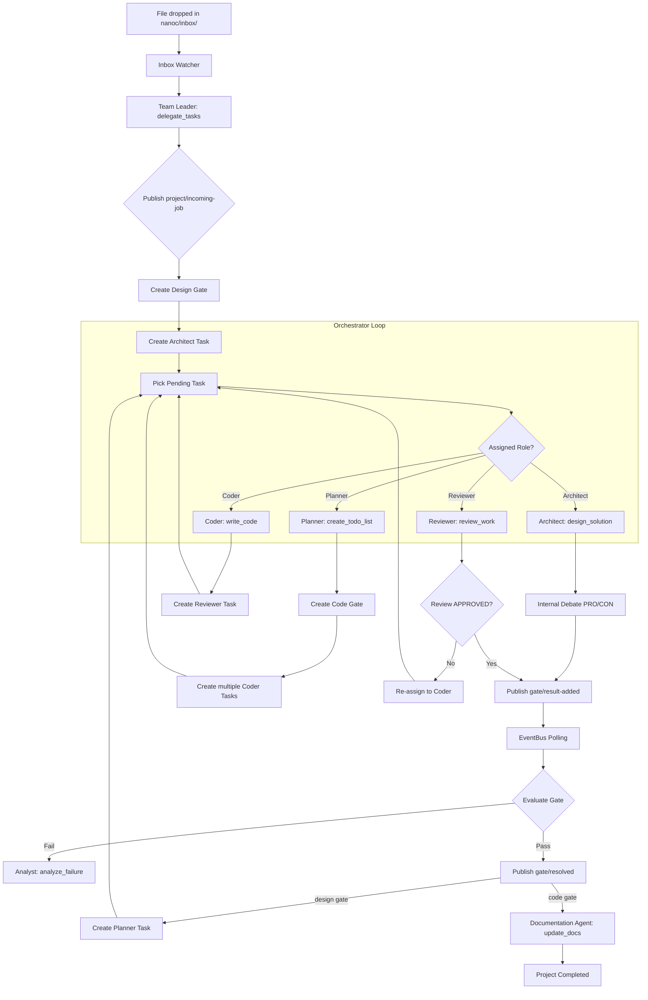
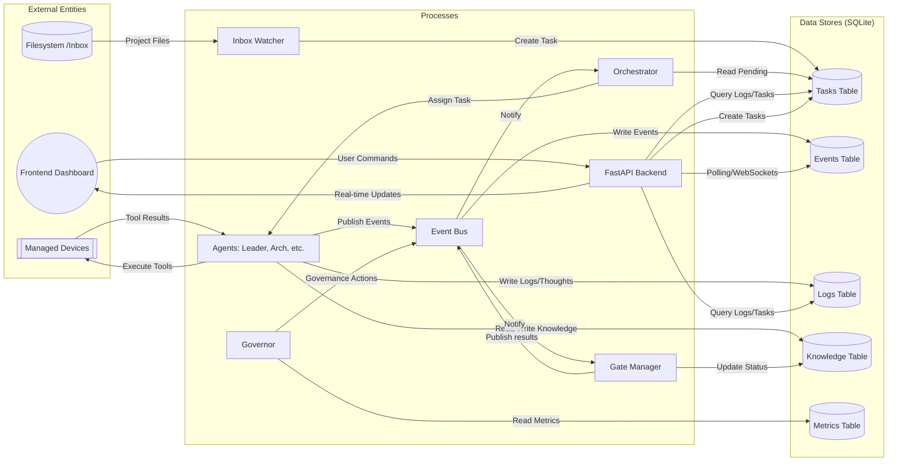

# NANOC System Diagrams

## 1. System Workflow Flowchart

```mermaid
graph TD
    A[File dropped in nanoc/inbox/] --> B[Inbox Watcher]
    B --> C[Team Leader: delegate_tasks]
    C --> D{Publish project/incoming-job}
    D --> E[Create Design Gate]
    E --> F[Create Architect Task]

    subgraph "Orchestrator Loop"
    F --> G[Pick Pending Task]
    G --> H{Assigned Role?}
    H -- Architect --> I[Architect: design_solution]
    H -- Planner --> J[Planner: create_todo_list]
    H -- Coder --> K[Coder: write_code]
    H -- Reviewer --> L[Reviewer: review_work]
    end

    I --> M[Internal Debate PRO/CON]
    M --> N[Publish gate/result-added]

    N --> O[EventBus Polling]
    O --> P{Evaluate Gate}
    P -- Fail --> Q[Analyst: analyze_failure]
    P -- Pass --> R[Publish gate/resolved]

    R -- design gate --> S[Create Planner Task]
    S --> G

    J --> T[Create Code Gate]
    T --> U[Create multiple Coder Tasks]
    U --> G

    K --> V[Create Reviewer Task]
    V --> G

    L --> W{Review APPROVED?}
    W -- No --> X[Re-assign to Coder]
    X --> G
    W -- Yes --> N

    R -- code gate --> Y[Documentation Agent: update_docs]
    Y --> Z[Project Completed]
```

## 2. Data Flow Diagram (DFD)

```mermaid
graph LR
    subgraph "External Entities"
        FS[(Filesystem /Inbox)]
        MD[[Managed Devices]]
        UI((Frontend Dashboard))
    end

    subgraph "Processes"
        IW[Inbox Watcher]
        OR[Orchestrator]
        AG[Agents: Leader, Arch, etc.]
        GM[Gate Manager]
        EB[Event Bus]
        GO[Governor]
        BE[FastAPI Backend]
    end

    subgraph "Data Stores (SQLite)"
        DB_T[(Tasks Table)]
        DB_E[(Events Table)]
        DB_L[(Logs Table)]
        DB_K[(Knowledge Table)]
        DB_M[(Metrics Table)]
    end

    FS -- Project Files --> IW
    IW -- Create Task --> DB_T

    OR -- Read Pending --> DB_T
    OR -- Assign Task --> AG

    AG -- Read/Write Knowledge --> DB_K
    AG -- Write Logs/Thoughts --> DB_L
    AG -- Publish Events --> EB
    AG -- Execute Tools --> MD
    MD -- Tool Results --> AG

    EB -- Write Events --> DB_E
    EB -- Notify --> OR
    EB -- Notify --> GM

    GM -- Update Status --> DB_K
    GM -- Publish results --> EB

    GO -- Read Metrics --> DB_M
    GO -- Governance Actions --> EB

    BE -- Polling/WebSockets --> DB_E
    BE -- Query Logs/Tasks --> DB_L
    BE -- Query Logs/Tasks --> DB_T

    BE -- Real-time Updates --> UI
    UI -- User Commands --> BE
    BE -- Create Tasks --> DB_T
```
